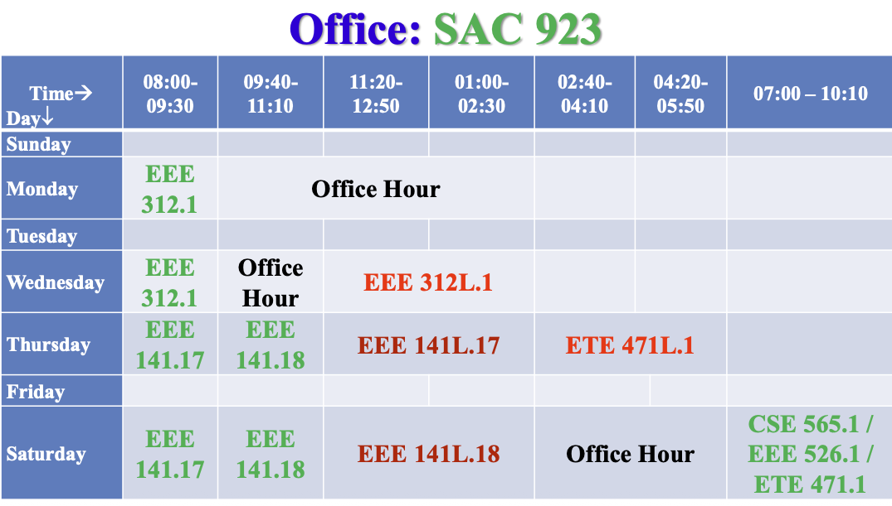

# CSE565.1 Digital Signal Processing

This folder contains course materials for `CSE565.1 Digital Signal Processing`.

## Course Info

- `Term: Summer 2026`
- `Semester: 2nd`
- `Faculty: AyL`
- `Office: SAC 923`
- `Class Room: SAC511`

## Schedule

- `Saturday: 07:00 PM - 10:10 PM`

## Office Hours

## Subdirectories

- `Pending`: Add course materials when available.
